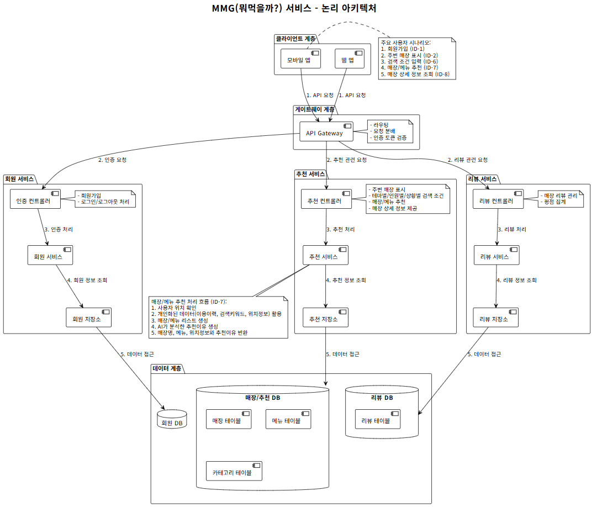

# MMG 서비스 (MMG)

## 1. 소개
MMG는 상황에 맞는 매장을 AI가 매장을 추천해주고, 리뷰 생성 및 요약 기능을 제공하는 서비스입니다.

### 1.1 핵심 기능
- **매장 추천**: 여러 매장 중에 사용자의 상황에 맞는 매장 추천 기능
- **하이오더**: 매장에 원격으로 주문을 접수하는 기능
- **리뷰 생성 요약**: 키워드만으로 리뷰를 생성해주고, 다른 사용자들의 리뷰를 요약해주는 기능

### 1.2 MVP 산출물
- **발표자료**: https://gamma.app/docs/AI--r1hi7yj732mtt9a
- **설계결과**: https://github.com/mmg-service/mmg-web/blob/main/readmeImages/설계결과.txt
- **Git Repo**: 
  - **프론트엔드**: https://github.com/mmg-service/mmg-web.git
  - **백엔드**: https://github.com/mmg-service/mmg.git
- **시연 동영상**:
    

## 2. 시스템 아키텍처

### 2.1 전체 구조
프론트엔드와 마이크로서비스 백엔드로 구성된 웹 애플리케이션


### 2.2 마이크로서비스 구성
- **회원 서비스 (Member)**: 사용자 인증 및 토큰 관리
- **추천 서비스 (Recommend)**: 사용자 맞춤형 매장 추천 서비스 + 하이오더
- **리뷰 서비스 (Review)**: 리뷰 생성 / 요약 서비스

### 2.3 기술 스택
- **프론트엔드**: Vue
- **백엔드**: Spring Boot
- **인프라**: Azure Kubernetes Service (AKS)
- **CI/CD**: Jenkins, Podman (컨테이너 빌드)
- **코드 품질**: SonarQube
- **백킹 서비스**:
  - **Database**: PostgreSQL

## 3. 프론트엔드 (mmg-web)

### 3.1 주요 화면
- **로그인 화면**: 사용자 인증
- **매장 추천**: 지도에 마커로 추천 매장 표시 및 매장 상세 정보 하단 표시
- **하이오더**: 원격 주문을 위한 화면
- **리뷰 요약**: 하이오더 상단의 해당 매장의 리뷰 요약 기능
- **리뷰 생성**: 주문 이후 리뷰 작성 시 키워드만으로 리뷰를 생성하는 기능 

### 3.2 API 연동
애플리케이션은 다음 백엔드 서비스와 API를 통해 통신합니다:
- `MEMBER_URL`: 인증 관련 API
- `RECOMMEND_URL`: 추천 관련 API
- `REVIEW_URL`: 리뷰 관련 API

## 4. 백엔드 서비스

### 4.1 인증 서비스 (Member)
회원 로그인 및 로그아웃, JWT 토큰 관리를 담당합니다.

#### 4.1.1 주요 API
- `POST /login`: 로그인
- `POST /logout`: 로그아웃

### 4.2 추천 서비스 (Recommend)
사용자의 상황에 따른 매장을 추천해줍니다.

#### 4.2.1 주요 API
- `GET /nearby`: 주변 매장 조회 및 추천

### 4.3 리뷰 서비스 (Review)
리뷰 생성 및 요약기능을 제공합니다.

#### 4.3.1 주요 API
- `GET /claude`: AI를 활용하여 리뷰 생성 기능을 제공합니다.
- `GET /reviewSummary`: 리뷰 요약 기능을 제공합니다. 

## 5. 개발 환경 설정

### 5.1 필수 요구사항
- Java 21 (백엔드)
- Node.js 20.19.0 (프론트엔드)
- Podman
- kubectl (Kubernetes CLI)
- Gradle (백엔드 빌드)

### 5.2 프론트엔드 개발 환경 설정
1. 저장소 클론
   ```bash
   git clone https://github.com/mmg-service/mmg-web.git
   cd mmg-web
   ```

2. 의존성 설치
   ```bash
   npm install
   ```

3. 개발 서버 실행
   ```bash
   npm run serve
   ```

4. 환경 설정
   프로젝트에서는 `.env` 파일을 통해 런타임 환경 설정을 관리합니다:
   ```javascript
   VUE_APP_MEMBER_API_URL=https://20.249.185.142.nip.io/api/members
   VUE_APP_RECOMMENDATION_API_URL=https://20.249.185.142.nip.io/api/recommendations
   VUE_APP_REVIEW_API_URL=https://20.249.185.142.nip.io/api/reviews
   VUE_APP_API_URL=https://20.249.185.142.nip.io
   ```

### 5.3 필요한 백킹 서비스 설치

#### 5.3.1 PostgreSQL 데이터베이스 설치
각 마이크로서비스는 별도의 PostgreSQL 데이터베이스를 사용합니다.

1. Docker로 설치
   ```bash
   # MMG 서비스용 DB
   docker run -d --name member-postgres \
     -e POSTGRES_DB=member \
     -e POSTGRES_USER=postgres \
     -e POSTGRES_PASSWORD=Hi5Jessica! \
     -p 5432:5432 \
     postgres:latest
   ```

### 5.4 백엔드 개발 환경 설정
1. 저장소 클론
   ```bash
   git clone https://github.com/mmg-service/mmg.git
   cd mmg
   ```

2. 의존성 설치 및 각 서비스 개별 빌드
   ```bash
   # 각 서비스 모듈을 개별적으로 빌드
   ./gradlew :member:build
   ./gradlew :recommend:build
   ./gradlew :review:build
   ```

3. 각 서비스 실행
   ```bash
   # Member 서비스 실행
   java -jar member/build/libs/member.jar

   # Recommend 서비스 실행
   java -jar recommend/build/libs/recommend.jar
   
   # Review 서비스 실행
   java -jar review/build/libs/review.jar
   
   ```

4. 환경 설정
   각 서비스는 `application.yml` 파일에서 설정을 관리합니다. 기본 구성:
   ```yaml
   server:
     port: 8081  # 각 서비스별로 다른 포트 사용
   
   spring:
     datasource:
       url: jdbc:postgresql://localhost:5432/member
       username: postgres
       password: Hi5Jessica!
   
   allowed-origins: http://localhost:3000
   ```

## 6. 빌드 및 배포

### 6.1 프론트엔드 빌드 및 배포
1. 애플리케이션 빌드
   ```bash
   npm run build
   ```

2. 컨테이너 이미지 빌드
   ```bash
   docker build \
     -f ./Dockerfile \
     -t acrmmg.azurecr.io/mmg/mmg-web:latest .
   ```

3. 이미지 푸시
   ```bash
   docker push acrmmg.azurecr.io/mmg/mmg-web:latest
   ```

4. Kubernetes 배포
   ```bash
   kubectl apply -f mmg-frontend-deployment.yaml
   ```

### 6.2 백엔드 빌드 및 배포
1. 애플리케이션 빌드
   ```bash
   # 각 서비스 모듈을 개별적으로 빌드
   ./gradlew :member:clean :member:build -x test
   ./gradlew :recommend:clean :recommend:build -x test
   ./gradlew :review:clean :review:build -x test
   ```

2. 컨테이너 이미지 빌드 (각 서비스별로 수행)
   ```bash
   # 각 서비스 별 컨테이너 이미지 빌드
   podman build \
     --build-arg BUILD_LIB_DIR="${buildDir}/build/libs" \
     --build-arg ARTIFACTORY_FILE="${jarFile}" \
     -f deployment/container/Dockerfile \
     -t ${props.registry}/${props.image_org}/${service}:${imageTag} .
   ```

3. 이미지 푸시
   ```bash
   podman push ${props.registry}/${props.image_org}/${service}:${imageTag}
   ```

4. Kubernetes 배포
   ```bash
   kubectl apply -f mmg-backend-member-deployment.yaml
   kubectl apply -f mmg-backend-recommend-deployment.yaml
   kubectl apply -f mmg-backend-review-deployment.yaml
   ```

## 7. 팀

- 최종민 "머니" - Product Owner, UI/UX
- 정나린 "리니" - 콘텐츠, QA
- 홍성민 "뽀로로" - CI/CD
- 김태우 "테디" - DA, TA
- 서동민 "퍼플" - S/M, FE
- 한덕재 "장군" - 디자이너, AA